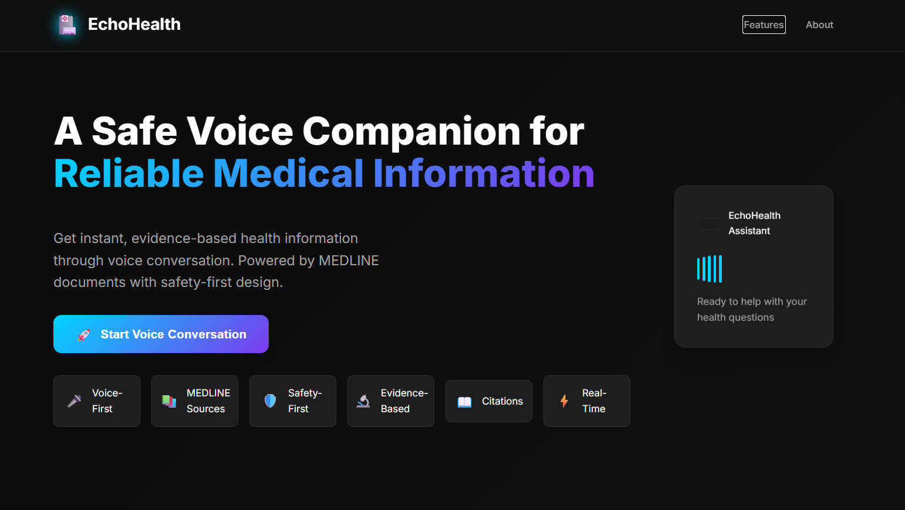
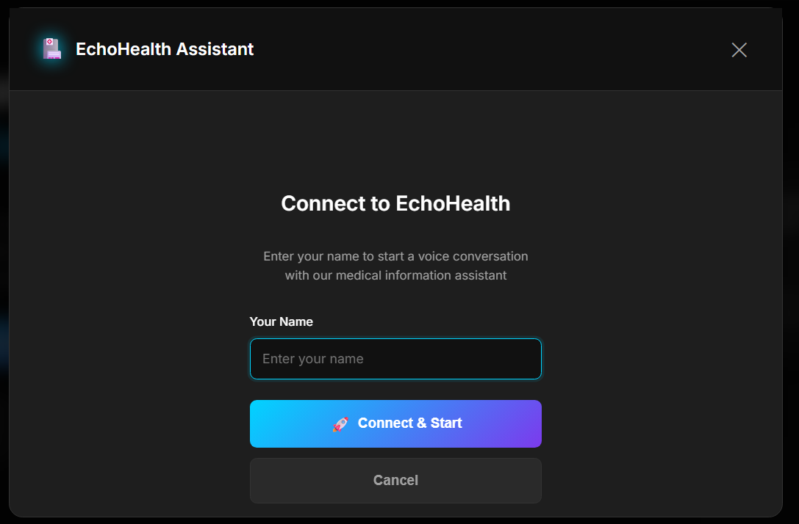
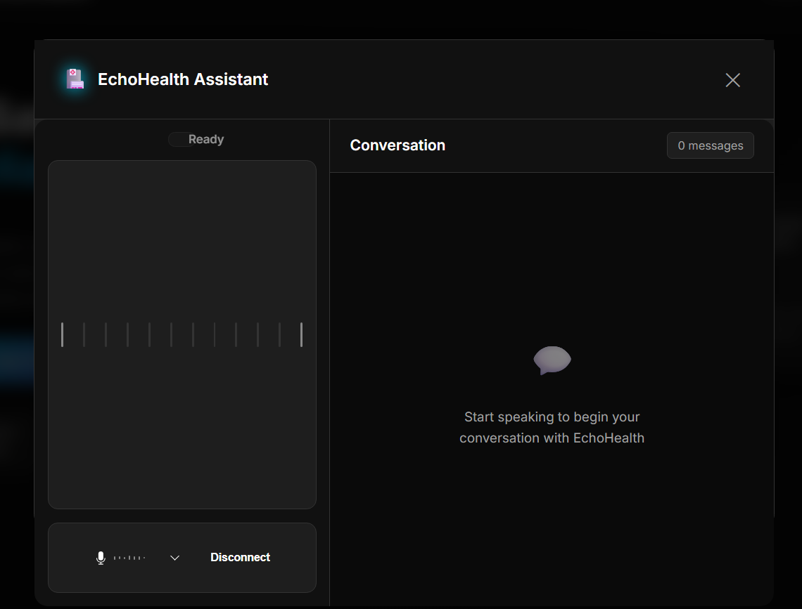
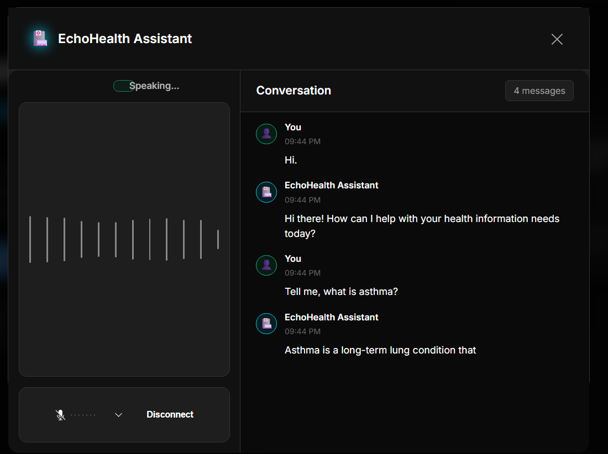
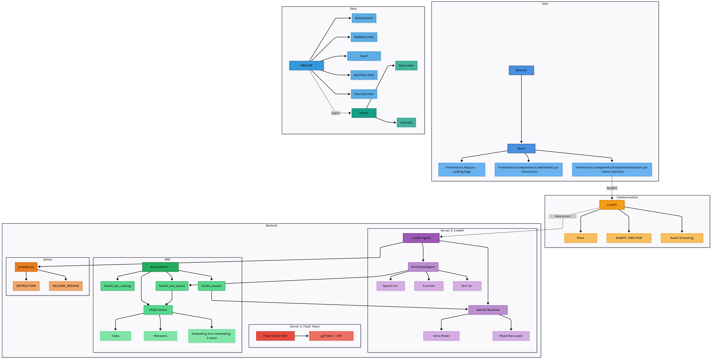
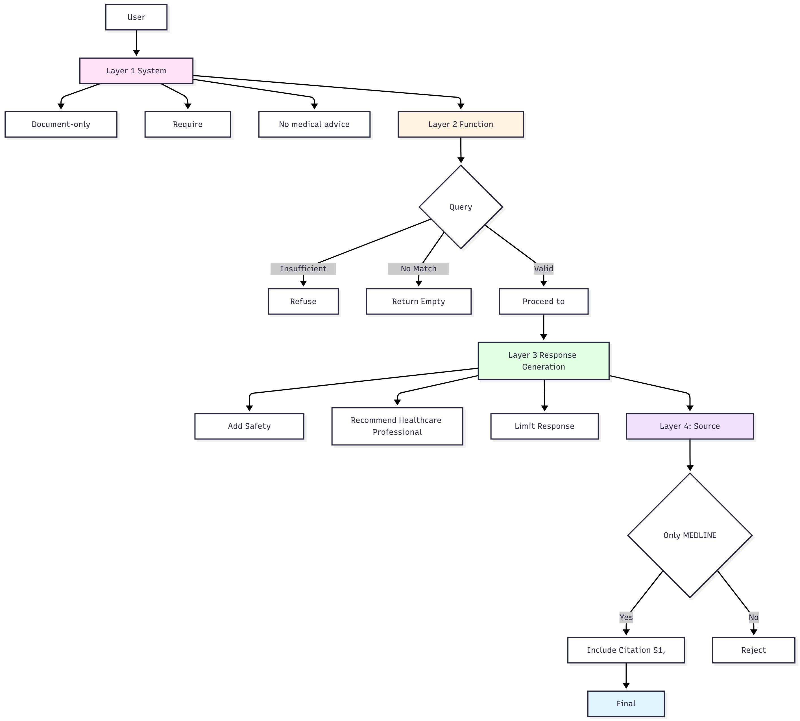
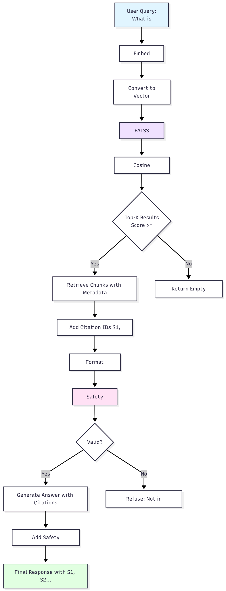

# EchoHealth: A Safe Voice Companion for Reliable Medical Information

<div align="center">



*A modern voice-first medical information assistant powered by LiveKit and OpenAI Realtime*

[](https://www.python.org/)
[](https://react.dev/)
[](https://livekit.io/agents)
[](https://platform.openai.com/)

</div>

## 🎯 Overview

EchoHealth is a cutting-edge voice-first medical information assistant that provides reliable, evidence-based health information through natural voice conversation. Built with safety-first principles, it only responds from trusted MEDLINE medical literature and always recommends professional healthcare consultation.

### ✨ Key Features

- **🎤 Voice-First Interaction** - Natural conversation via WebRTC (LiveKit)
- **📚 MEDLINE Sources** - Responses only from trusted medical literature
- **🛡️ Safety-First Design** - No personal medical advice, always recommends professionals
- **🔬 Evidence-Based** - All responses backed by medical research
- **📖 Citations** - Inline source references [S1], [S2] for transparency
- **⚡ Real-Time** - Live voice processing with OpenAI Realtime API

## 🎬 Demo

Watch EchoHealth in action:

https://github.com/yourusername/livekit_health_agent/blob/master/ECHOHEALTH_DEMO.mp4

*Demonstrates voice-first interaction, RAG-powered responses, and safety features*

## 🚀 Quick Start

### Prerequisites

- **Python 3.10+** - Backend runtime
- **Node.js 18+** - Frontend development
- **LiveKit Cloud Project** - Voice communication infrastructure
- **OpenAI API Key** - For embeddings and voice processing

### Environment Configuration

1. **Backend Environment** (`backend/.env`):
```ini
LIVEKIT_API_KEY=lkc_xxx
LIVEKIT_API_SECRET=xxx
OPENAI_API_KEY=sk-xxx
```

2. **Frontend Environment** (`frontend/.env.local`):
```ini
VITE_LIVEKIT_URL=wss://your-project-id.livekit.cloud
```

### Installation & Setup

```bash
# 1. Backend Setup
cd backend
python -m venv .venv
. .venv\Scripts\Activate.ps1  # Windows PowerShell
pip install -r ..\requirements.txt
pip install openai numpy faiss-cpu pypdf

# 2. Build Document Index
python ingest.py

# 3. Start Backend Services (2 terminals)
python agent.py   # Terminal 1: LiveKit agent worker
python server.py  # Terminal 2: Token server (port 5001)

# 4. Start Frontend (separate terminal)
cd ../frontend
npm install
npm run dev  # Opens http://localhost:5173
```

## 📱 User Interface

### Home Page


The modern dark-themed landing page features:
- **Hero Section** with gradient text and feature highlights
- **6 Key Features** displayed in a single row
- **Call-to-Action** button to start voice conversation
- **Floating Card** animation showing assistant status

### Getting Started


The connection modal provides:
- **Clean Form Design** with centered content
- **Name Input** with focus states and validation
- **Gradient Connect Button** with rocket icon
- **Cancel Option** for easy exit

### Voice Assistant Interface


The split-pane voice interface includes:
- **Left Pane**: Voice controls, status indicator, and audio visualizer
- **Right Pane**: Real-time conversation with message history
- **Status Indicators**: Shows listening, speaking, or thinking states
- **Control Bar**: Microphone controls and disconnect option

### Example Conversation


Sample interaction showing:
- **User Question**: "What is asthma?"
- **Agent Response**: Evidence-based answer with citations
- **Source References**: [S1], [S2] inline citations
- **Safety Notice**: Recommendation to consult healthcare professionals

## 🏗️ Architecture



**Complete system architecture showing:**
- Frontend (React + LiveKit Components)
- LiveKit Cloud (WebRTC audio streaming)
- Backend (LiveKit Agent + OpenAI Realtime)
- RAG System (FAISS index + MEDLINE documents)

### Project Structure

```
livekit_health_agent/
├── backend/
│   ├── agent.py          # LiveKit Agents worker with OpenAI Realtime
│   ├── api.py            # RAG tools (document search + answer generation)
│   ├── ingest.py         # FAISS index builder from MEDLINE documents
│   ├── prompts.py        # Health safety rules and system prompts
│   ├── server.py         # Flask token server for LiveKit authentication
│   └── db_driver.py      # Database utilities (placeholder)
├── frontend/
│   ├── src/
│   │   ├── App.jsx       # Main application component
│   │   ├── components/
│   │   │   ├── LiveKitModal.jsx        # Connection modal
│   │   │   └── SimpleVoiceAssistant.jsx # Voice interface
│   │   └── styles/       # Modern dark theme CSS
│   └── package.json      # React dependencies
├── docs/                 # MEDLINE HTML documents for RAG
├── rag/                  # Generated FAISS index and metadata
└── requirements.txt      # Python dependencies
```

## 🛡️ Safety Features

EchoHealth is designed with medical safety as the top priority:

- **🚫 No Personal Medical Advice** - Agent explicitly declines diagnosis requests
- **📋 Document-Only Responses** - Answers only from indexed MEDLINE content
- **❓ Uncertainty Handling** - States when information isn't available
- **👨‍⚕️ Professional Referral** - Always recommends consulting healthcare providers
- **📖 Source Transparency** - Every response includes citations
- **⚠️ Safety Disclaimers** - Clear warnings about limitations



**Multi-layer safety architecture ensuring:**
- System prompt validation
- Function call verification
- Response generation with safety checks
- Source verification and citation

## 🔍 RAG Workflow



**Retrieval-Augmented Generation process:**
1. User query → embedding generation
2. Vector search in FAISS index
3. Top-k document retrieval
4. Context enrichment
5. LLM generates cited response

**Real-time voice conversation flow:**
- User speech → WebRTC → LiveKit → Agent
- RAG retrieval → LLM processing → Voice response
- End-to-end latency < 3 seconds

## 🆚 How EchoHealth Differs

[Download Comparison PDF](echohealth_comparison.pdf)

**Key advantages over traditional chatbots:**
- Voice-first interaction instead of text-only
- Evidence-based RAG system with MEDLINE sources
- Full transparency with verifiable sources
- 4-layer safety architecture
- Real-time WebRTC audio streaming
- No hallucinations - only verified information

## 🔧 Usage Guide

### Starting a Conversation

1. **Launch Application** - Click "Start Voice Conversation" on home page
2. **Enter Name** - Provide your name in the connection modal
3. **Connect** - Click "Connect & Start" to join the voice room
4. **Allow Microphone** - Grant browser permission for audio access
5. **Begin Speaking** - Ask health questions naturally

### Example Queries

- "What is asthma?"
- "What are the symptoms of diabetes?"
- "How can I maintain a healthy diet?"
- "What are the benefits of exercise?"
- "Tell me about heart disease prevention"

### Response Format

Each response includes:
- **Evidence-based answer** from MEDLINE sources
- **Inline citations** like [S1], [S2] for transparency
- **Safety disclaimer** recommending professional consultation
- **Source references** for further reading

## 🐛 Troubleshooting

### Common Issues

| Issue | Solution |
|-------|----------|
| **Token errors (404/500)** | Ensure Flask server runs on port 5001 |
| **RAG error: "Index missing"** | Run `python ingest.py` after adding documents |
| **LiveKit connection failure** | Verify `VITE_LIVEKIT_URL` and API credentials |
| **401 Unauthorized** | Check `LIVEKIT_API_KEY/SECRET` in backend/.env |
| **No audio/mic permissions** | Allow microphone access in browser |
| **Missing Python dependencies** | Install: `pip install openai numpy faiss-cpu pypdf` |

### Development Tips

- **Document Updates**: Re-run `python ingest.py` when adding/updating files in `docs/`
- **Room Management**: Agent automatically joins `health-room`
- **Customization**: Edit `backend/prompts.py` to modify response style
- **Debugging**: Check browser console and terminal logs for errors

## 🔄 Development Workflow

### Adding New Documents

1. Place HTML files in `docs/` directory
2. Run `python ingest.py` to rebuild FAISS index
3. Restart the agent: `python agent.py`
4. Test with new queries

### Customizing Responses

1. Edit `backend/prompts.py` for system prompts
2. Modify safety rules and welcome messages
3. Restart agent to apply changes
4. Test conversation flow

## 📊 Technical Specifications

- **Backend**: Python 3.10+ with LiveKit Agents
- **Frontend**: React 19 with Vite build system
- **Voice Processing**: OpenAI Realtime API
- **Document Search**: FAISS vector database
- **Communication**: WebRTC via LiveKit Cloud
- **Styling**: Modern CSS with dark theme

## 🤝 Contributing

1. Fork the repository
2. Create a feature branch
3. Make your changes
4. Test thoroughly
5. Submit a pull request

## 📄 License

This project is licensed under the MIT License - see the LICENSE file for details.

## 🙏 Acknowledgments

- [LiveKit Agents](https://livekit.io/agents) - Voice AI infrastructure
- [LiveKit Components](https://livekit.io/docs/client/components) - React UI components
- [OpenAI Realtime](https://platform.openai.com/docs/guides/realtime) - Voice processing API
- [MEDLINE](https://medlineplus.gov/) - Medical information sources

---

<div align="center">

**⚠️ Medical Disclaimer**: EchoHealth is for informational purposes only and does not provide medical advice, diagnosis, or treatment. Always consult with qualified healthcare professionals for medical concerns.

Made with ❤️ for better healthcare information access

</div>